# Memory

A Memory card game for two players that runs in the browser. Two players take turns on one device and the one who finds more pairs wins. Built as a course project for the Developer Akademie with TypeScript, Vite and SCSS, without a UI framework.

[**Live Demo (Ctrl + Click → new tab)**](https://memory.viktor-wilhelm.de/)

| Version | Link | Built from |
| --- | --- | --- |
| Production | [memory.viktor-wilhelm.de](https://memory.viktor-wilhelm.de/) | `main` |
| Staging | [memory-staging.viktor-wilhelm.de](https://memory-staging.viktor-wilhelm.de/) | `staging`, the version under review |

Changes reach production only after they have been checked on staging, so the two versions can differ.

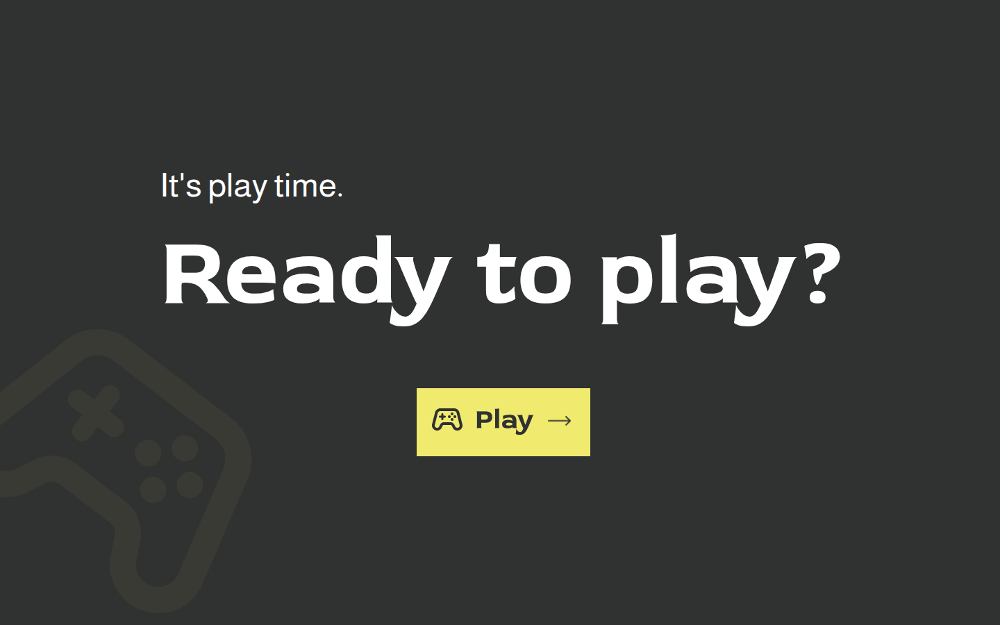

## How to play

1. Pick a theme, a player color and a board size in Settings. The chosen color is the player who starts.
2. On your turn, flip two cards.
3. Two matching cards stay face up, you score a point and play again.
4. Two different cards turn back after one second and the turn passes to the other player.
5. The round ends when every pair has been found. The player with more pairs wins; equal scores are a draw.
6. A Game Over screen shows the final score, followed by the Winner or Draw screen. "Back to start" (or "Home") returns to the start screen for a new round.

## Themes and board sizes

Every theme has its own colors, card backs, 18 card motifs and its own Game Over, Winner and Draw screens.

| Theme | Motifs |
| --- | --- |
| Code vibes | Developer tools and logos, for example Git, TypeScript, HTML and Angular |
| Gaming | Game motifs, for example dice, Pac-Man, a mushroom and a game controller |
| DA Projects | Illustrations and logos, for example a ramen bowl, a chef hat, a shopping basket and a Poke Ball |
| Foods | Food illustrations, for example a burger, sushi, a donut and macarons |

| Board | Cards | Pairs | Layout |
| --- | --- | --- | --- |
| 4 x 4 | 16 | 8 | 4 columns, 4 rows |
| 4 x 6 | 24 | 12 | 6 columns, 4 rows |
| 6 x 6 | 36 | 18 | 6 columns, 6 rows |

## Screenshots

Settings, where theme, player and board size are chosen:

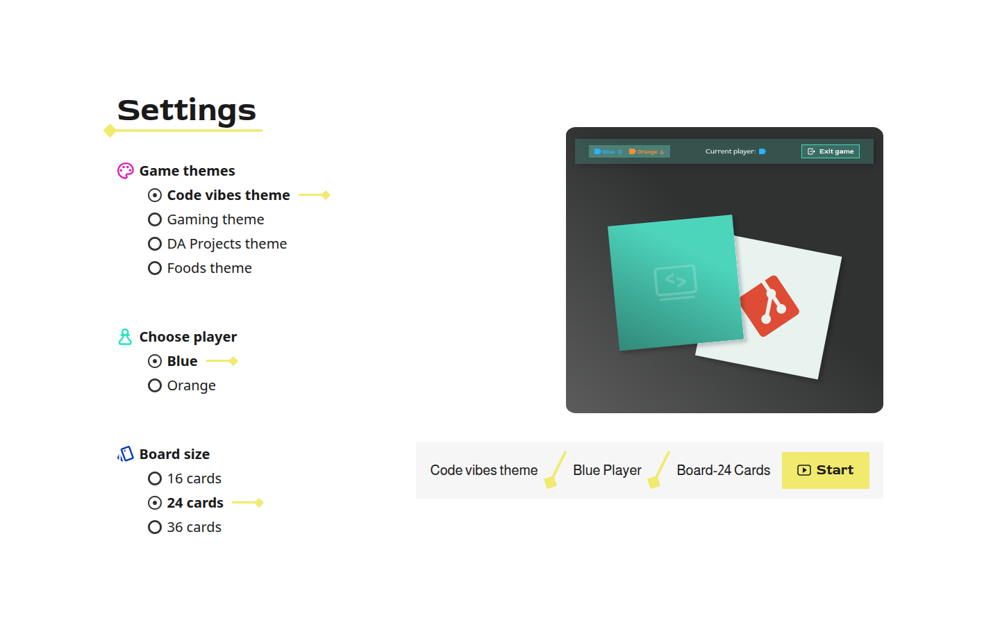

The board in all four themes (24 cards, a game in progress):

| | |
| --- | --- |
| 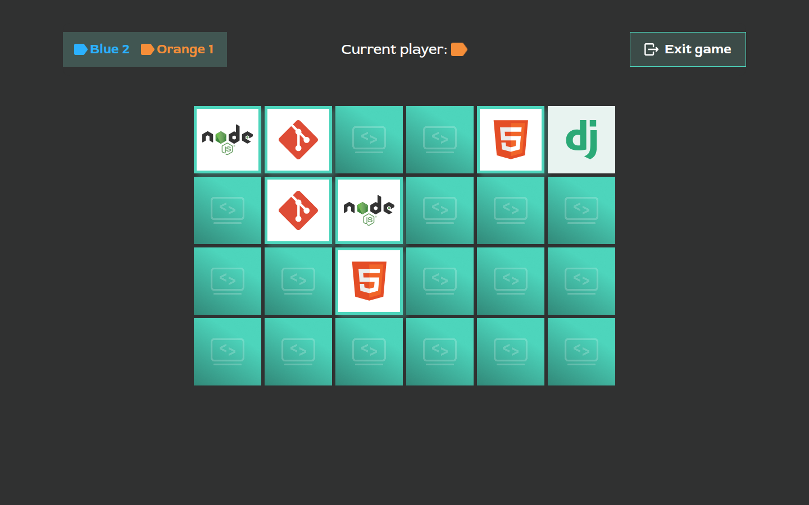 | 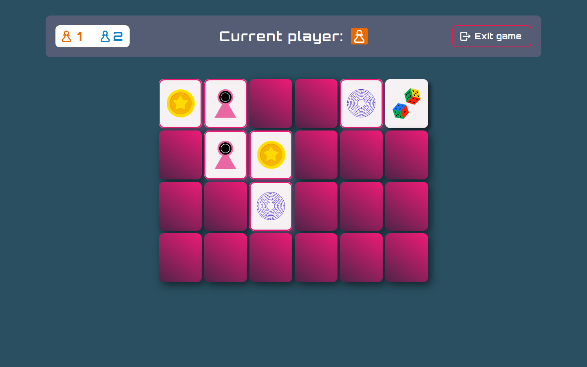 |
| 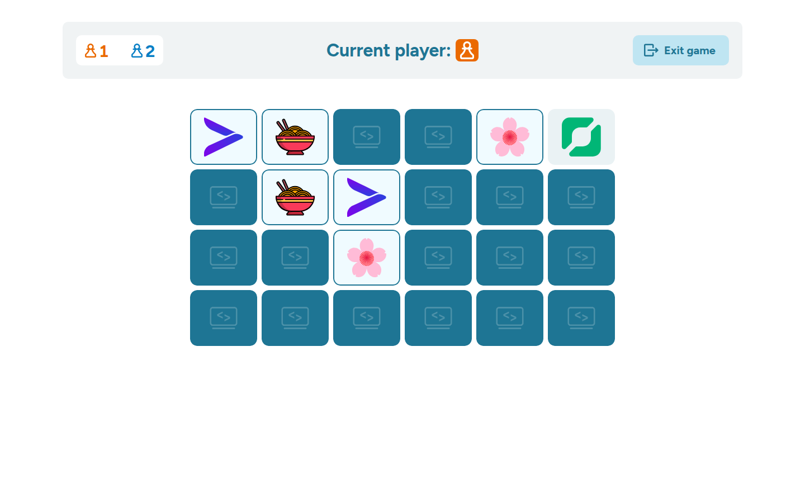 | 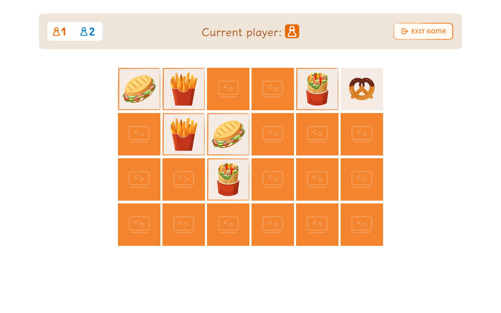 |

Game Over and the themed result screens:

| | | |
| --- | --- | --- |
| 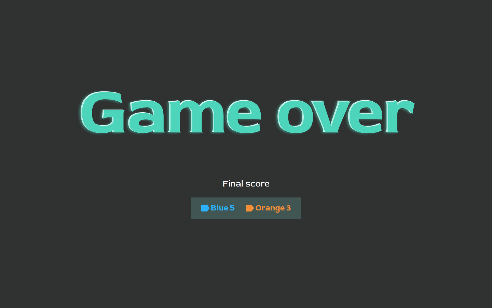 | 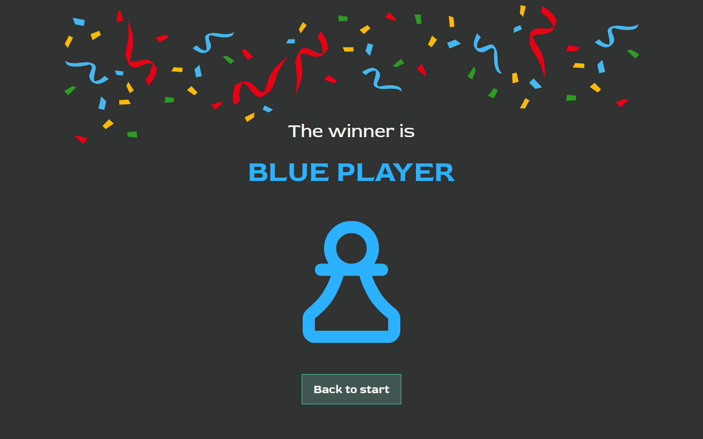 | 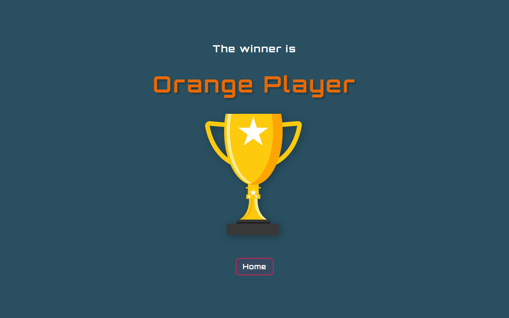 |
| Game Over | Winner, Code vibes | Winner, Gaming |

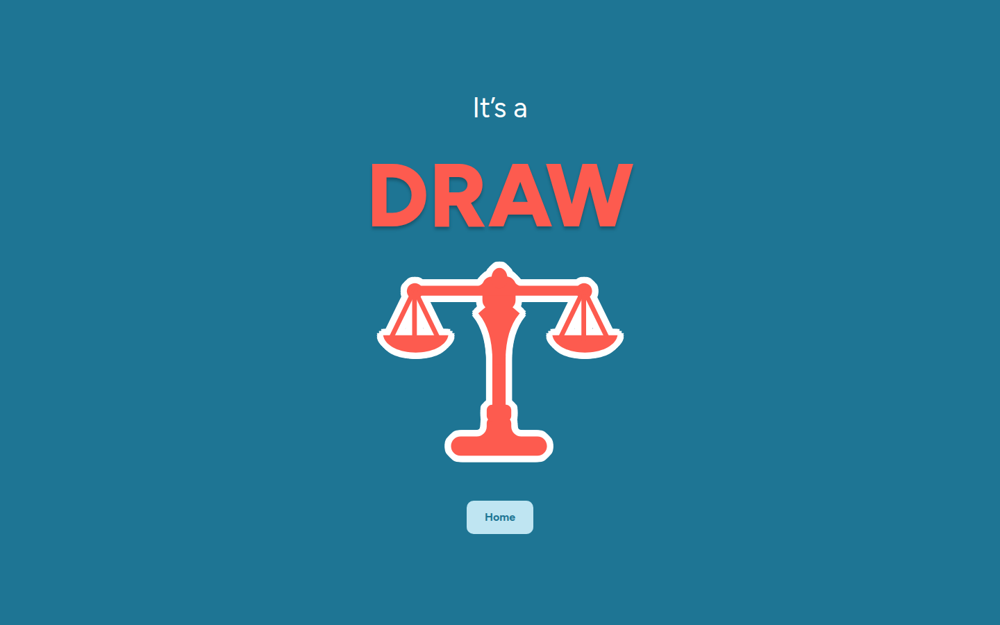

On a phone (390 px wide):

| | | |
| --- | --- | --- |
| 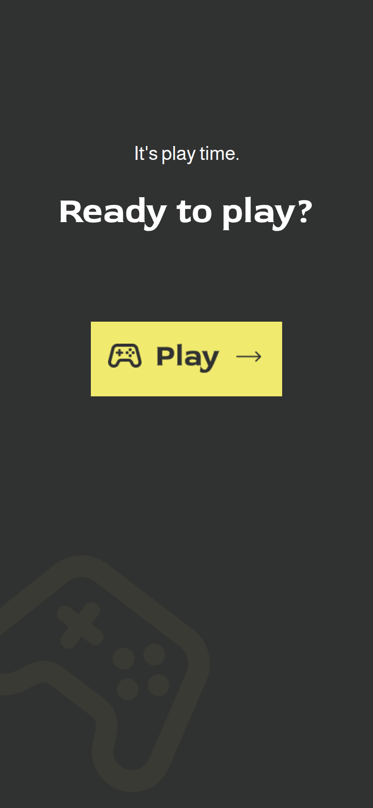 | 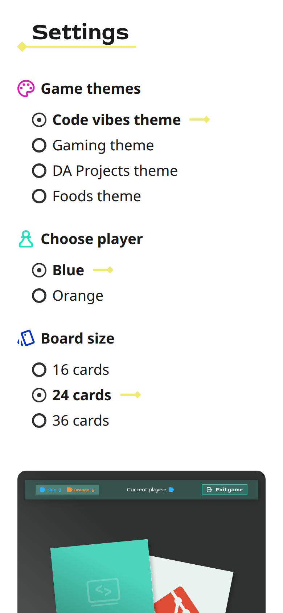 | 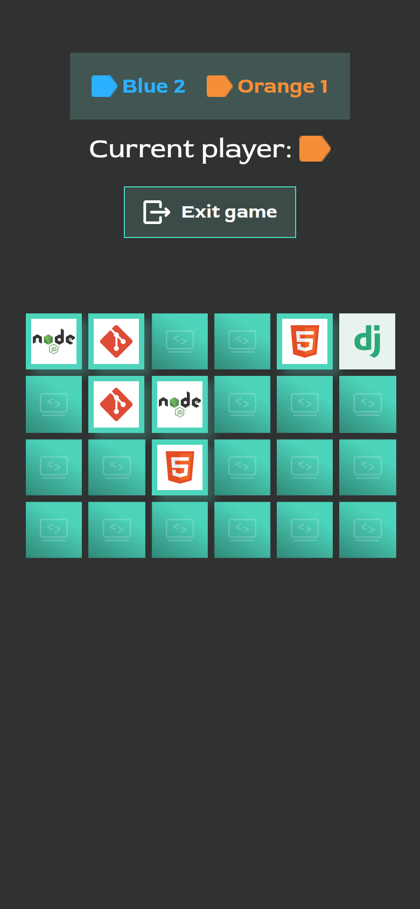 |

## Features

- Responsive layout from small phones (320 px wide) up to ultrawide screens.
- Settings with a live theme preview on hover and a summary of the choices; Start is enabled once theme, player and board size are chosen.
- Flip animation for the cards and a short delay before a mismatched pair turns back.
- Exit button on the board that opens a confirmation dialog, styled and animated per theme.
- Themed Game Over, Winner and Draw screens, for example with confetti in Code vibes and a trophy in Gaming.
- Images cannot be selected or dragged.

The cards are played with mouse or touch.

## Tech stack

- TypeScript 7 (strict mode), no UI framework
- Vite 8 for development and the production build
- Sass (SCSS) for styling, with per-screen modules and theme tokens
- HTML and SVG templates in `src/templates`, loaded with Vite's `?raw` imports
- Prettier for formatting
- GitHub Actions deploy to IONOS web space over SFTP

## Getting started

Requirements: Node.js 20.19+ or 22.12+ and [pnpm](https://pnpm.io/).

```bash
pnpm install     # install dependencies
pnpm dev         # start the dev server, http://localhost:5173 by default
pnpm build       # type check and build the production bundle into dist/
pnpm preview     # serve the built dist/ folder locally
```

`pnpm install` may report an ignored build script for `@parcel/watcher`; it is not needed to run or build the app. The repository tracks `package-lock.json` and the deployment workflows install with `npm ci`.

## Project structure

```
src/
  app/          game rules and state, deck, screen routing, template helper
  config/       themes, board sizes, players, shared icons
  views/        one module per screen: home, settings, board, game over, result
  templates/    HTML and SVG markup used by the views
  styles/       SCSS: tokens, themes, base, components and per-screen modules
public/assets/  images per theme and screen
docs/           screenshots, Figma references, workflow notes
.github/workflows/  deployment to staging and production
```

## Branches and deployment

Work happens on `feature/*` or `fix/*` branches that start from `dev`. Changes move from `dev` to `staging` and from `staging` to `main` through pull requests. A push to `staging` or `main` builds the app with `npm ci && npm run build` and uploads `dist/` to the matching site. Details (in German) are in [docs/git-workflow-deployment.md](docs/git-workflow-deployment.md).

## Code conventions

The code follows the academy's HTML and TypeScript conventions: kebab-case file names, TSDoc on functions, functions of at most 14 lines, named constants instead of magic numbers and markup kept in template files.
